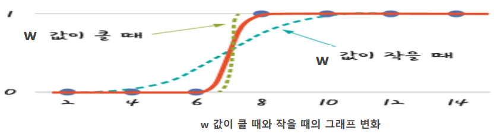
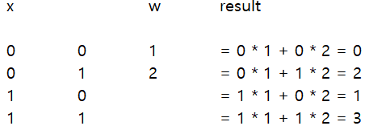
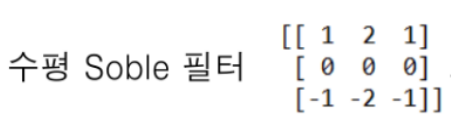
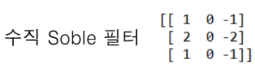
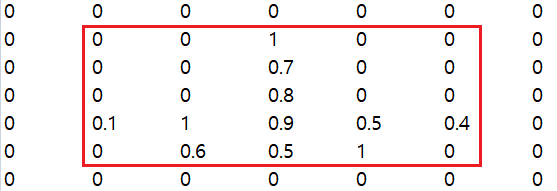
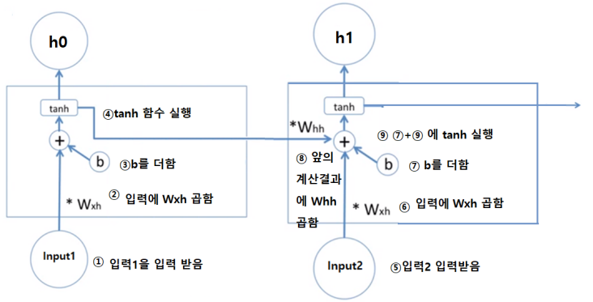

# 딥러닝(Depp learning)

## 비용함수(Cost Function)
 - 거리(cost or error)의 평균을 구하는 함수를 비용함수(cost function)라고 한다.
 - 비용(cost)은 예측한 값과의 거리를 나타내며, 비용은 0에 가까울수록 좋다.
 - 비용(cost)==오차(error)라고도 한다.
 - 계산식
   - $(예측값 - 실제값)^2$의 평균
	 $$cost(W, b) = \frac{1}{m}\sum_{i=1}^{m}(H(x^{(i)}) - y^{(i)})^2$$
	 > 절대값을 하지 않고, 제곱을 하는 이유는 비용에 패널티를 부과하기 위함(1보다 큰 경우 큰 패널티를 주고 1보다 작은 경우 이점을 주기 위함)

<br>

### Gradient Decent
 - 입력값(독립변수, feature), 예측하고 싶은 값(종속변수, target, class)
 - 예시 -> 선형회귀식에서 $wx + b$에서 w = 2, b = 1로 초기화하고 비용함수가 최소화되는 w와 b를 찾는 법
   - ```python
		import numpy as np

		# X : 독립변수(입력값)
		X = np.array([1, 2, 3], dtype='float32')
		# y : 종속변수(예측하고 싶은 값, 출력값)
		y = np.array([2, 2.5, 3.5], dtype='float32')

		# 러프하게 random 값을 지정
		# 초기 선형 회귀 식은 wX + b = 2X + 1
		w = 2
		b = 1

		# X * w + b를 실행해서 예측값을 hypothesis에 대입
		hypothesis = X * w + b
		```
   - 독립변수는 대문자, 종속변수는 소문자로 작성한다.
   - 머신러닝(machine_learning)에서는 dataframe에서 넣지만 딥러닝(deep_learning)에서는 array에 넣는다.
     > 딥러닝에서는 미분을 하기 때문에 미분에 용이한 array를 사용한다. 
   - 예측값(Hypothesis)라고 한다. -> $H(x)$
<br><br>

#### 순간 변화율
 - 순간 변화율은 '어느 쪽'이라는 방향성을 지니고 있으므로 이 방향에 맞추어 직선을 그릴 수 있다.
 - 이 선이 바로 이 점에서의 '기울기'라고 불리는 접선을 의미한다.
 - 비용(cost)을 감소하려면 w를 값을 수정하기가 어렵다.
   > 2차원 함수라서 w값을 개선하기 어렵다. <br>
   > 접선이 가르키는 각도(기울기)로 w값을 수정하면 비용(cost)이 감소한다.
 - 계산식
    $$\frac{d}{dx}f(x)=\lim_{\triangle{x}\to0}\frac{f(x + \triangle{x}) - f(x)}{x}$$
<br><br>

#### 예측(Hypothesis)
 - hypothesis
 $$H(x)=Wx + b$$
 - W에 대한 기울기
   - cost  
 $$\begin{align}cost(W, b)&=\frac{1}{2m}\sum_{i=1}^{m}(H(x_{i}) - y_{i})^2 \\&=\frac{1}{2m}(H(x) - y)^2 \\&=\frac{1}{2m}(H(x)^2-2H(x)y+y^2) \\&=\frac{1}{2m}((Wx+b)^2-2(Wx+b)y+y^2) \\&=\frac{1}{2m}((W^2x^2+2Wxb+b^2)-2Wxy-by+y^2) \\&=\frac{1}{2m}(W^2x^2+2Wxb-2Wxy) \\&=\frac{1}{2m}(2Wx^2+2xb-2xy) \\&=\frac{1}{2m}2(Wx^2+xb-xy) \\&=\frac{1}{2m}2(Wx+b-y)x \\&=\frac{1}{m}(Wx+b-y)x \\&=\frac{1}{m}(H(x)-y)x \\\end{align}$$
 > cost가 감소하는 w가 알고싶다. -> cost를 w에 대해서 미분 <br>
 > 1. w가 없으면 삭제 <br>
 > 2. w가 있으면 미분 $W^2-> 2W^{2-1}$<br>
 > 3. 기울기 공식 : $W-\frac{1}{m}(H(x)-y)x$<br>
 - b에 대한 기울기
   - cost
$$\begin{align}
cost(W,b)&=\frac{1}{2m}((W^2x^2+2Wxb+b^2)-2Wxy-2by-y^2) \\
&=\frac{1}{2m}(2Wxb+b^2-2by)\\
&=\frac{1}{2m}(2Wx+2b-2y)\\
&=\frac{1}{2m}2(Wx+b-y)\\
&=\frac{1}{m}(Wx+b-y)\\
&=\frac{1}{m}(H(x)-y)\\
\end{align}
$$
 > cost가 감소하는 b가 알고싶다. -> cost를 b에 대하여 미분 <br>
 > 1. $b^2 -> 2b^{2-1}=2b^1=2b$ <br>
 > 2. $b^1 -> b^{1-1}=b^0=1$ <br>
 > 3. 기울기 공식 : $b-\frac{1}{m}(H(x)-y)$ <br>
 - $\frac{\delta{E}}{\delta{W}}$ -> E와 W를 미분하였다는 기호
<br><br>

### Learning Rate와 Gradient Decent
 - Overshooting이 일어나지 않도록 w_gred와 b_gred에 1보다 작은 소수를 곱해서 w_gred와 b_gred의 값을 감소시킨다.
 - w_gred와 b_gred에 곱해지는 1보다 작은 소수를 learning_rate라고 한다.<br><br>
  
## 텐서플로우(Tensorflow)
 - 가장 많이 사용하고 있는 딥러닝 프레임워크
 - 빠른 수행속도
 - 비교적 쉬운 개발 -> 파이포치보다 쉬움
 - 직접예측
   - $W * X + b$
 - 입력값을 주면 알아서 예측하는 Keras 객체
   - `Sequential()` object
   - 구문
		```python
			model = Sequential()

			# Dense() -> 선형회귀
			# output_dim : 출력 칸수, input_dim : 입력 칸수, 입력값(독립변수)
			model.add(Dense(output_dim, input_dim=1))
			model.summary()
		```
     - summary() 실행 시 
       > Layout : 출력 형식, Output Shape : 출력 줄수, Param : W, b의 개수

<br>

## 인공신경망(Neural Network)
 - 인공신경망의 다른이름 퍼셉트론(Perceptron)
 - 다수의 신호를 입력으로 받아 하나의 신호를 출력한다.
 - 활성함수를 통해서 데이터를 처리한다.
<br><br>

### AND연산
 - 모두 `True`일 때, `True`를 반환
   - `0 == False, None`
   - `1 == True, not None`

<br>

### 선형회귀 cost function
 - MSE(Mean Squared Error) = $\frac{\sum_{i = 1}^{m}(H(x) - y)^2}{데이터 수}$
 - 인공신경망 (결과가 0 or 1)
   - H(x) = 1, y = 1
     - MSE = $\frac{(1-1)^2}{1}=0$
   - H(x) = 1, y = 0
     - MSE = $\frac{(1-0)^2}{1}=1$
 - 수식
$$cost=\Big\{^{-\log(H(x))  y=1}_{-\log(1-H(x))  y=0}$$
   - $cost=-\log(H(x))$
     - $y=1, H(x)=1$일 때
       - cost => $-\log(H(x))=-\log(1)=0$
     - $y=1, H(x)=0$일 때
       - cost => $-\log(H(x))=-\log(0)=\\infty$
   - $cost=-\log(1-H(x))$
     - $y=0, H(x)=0$일 때
       - cost => $-\log(1-H(x))=-\log(1)=0$
     - $y=0, H(x)=1$일 때
       - cost => $-\log(1-H(x))=-\log(0)=\\infty$
 - Binary cross entropy
$$C(H(x), y)=-y\log(H(x))-(1-y)\log(1-H(x))$$
   - $y=0$
     - $cost=-y\log(H(x))-(1-y)\log(1-H(x))=-0\log(H(x))-(1-0)\log(1-H(x))=-\log(1-H(x))$
   - $y=1$
     - $cost=-y\log(H(x))-(1-y)\log(1-H(x))=-1\log(H(x))-(1-1)\log(1-H(x))=-\log(H(x))$

<br>

### 시그모이드 함수(Sigmoid Function)
 - 선형 회귀 결과를 0과 1로 변환해서 반환하는 함수
 - 여기서 $e$는 자연상수이다.
 - 계산식
 $$ y=\frac{1}{1+e^{-(Wx+b)}} $$
 - 구해야하는 식은 $Wx+b$에서 W와 b이다.
 - Sigmoid 계산한 값 그래프


<br>

### XOR 연산
 - 칸이 여러 개인 배열의 곱(행렬의 곱)

  
   > $W_1$의 기울기 $=(H(x)-y)x_1$ <br>
   > $W_2$의 기울기 $=(H(x)-y)x_2$
 - `True == 1 == not None`
 - `False == 0 == None`

<br>

# 분산
 - 편차 제곱을 데이터의 개수 - 1로 나눈 것
 - 데이터의 차이를 하나의 숫자로 나타낸다.

<br>

## 편차
 - 데이터와 평균의 차
<br><br>

## 표준편차
 - 분산에 루트를 계산한 것

## 몫의 미분(분수의 미분)
 - $\frac{1}{g(x)}$을 미분 $\bigg\{\frac{1}{g(x)}\bigg\}^\prime$
 $$ \bigg\{\frac{1}{g(x)}\bigg\}^\prime=-\frac{g(x)^\prime}{g(x)^2} $$
 - $\bigg\{\frac{1}{x^2}\bigg\}^\prime$
 $$ \begin{align}
g(x)&=x^2\\
g(x)^\prime&=2x^2-1=2x^1=2x 
 \end{align}$$ 
<br>

## 자연상수 e
 - 자연상수 e의 미분
 - $\{e^{x^2}\}^\prime=e^{x^2}(x^2)^\prime=2xe^{x^2}$
 - $h=Wx+b$일 때 Sigmoid 미분
 - $Sigmoid=\frac{1}{1+e^{-(Wx+b)}}=\frac{1}{1+e^{-h}}$
   - $g(h)=1+e^{-h}$
   - $g(h)^\prime=(1+e^{-h})^\prime=(e^{-h})^\prime=e^{-h}(-h)^\prime=-e^{-h}$  
 $$ \begin{align}
 (Sigmoid)^\prime&=\bigg\{\frac{1}{1+e^{-h}}\bigg\}^\prime\\
 &=\bigg\{\frac{1}{g(h)}\bigg\}^\prime\\
 &=-\frac{g(h)^\prime}{g(h)^2}\\
 &=\frac{e^{-h}}{(1+e^{-h})^2}\\
 &=\frac{e^{-h}*1}{(1+e^{-h})(1+e^{-h})}\\
 &=\frac{e^{-h}}{(1+e^{-h})}*\frac{1}{(1+e^{-h})}\\
 &=\frac{1}{(1+e^{-h})}*\bigg\{\frac{e^{-h}+1-1}{(1+e^{-h})}\bigg\}\\
 &=\frac{1}{(1+e^{-h})}*\bigg\{\frac{(1+e^{-h})-1}{(1+e^{-h})}\bigg\}\\
 &=\frac{1}{(1+e^{-h})}*\bigg\{\frac{(1+e^{-h})}{(1+e^{-h})}*\frac{-1}{(1+e^{-h})}\bigg\}\\
 &=\frac{1}{(1+e^{-h})}*\bigg\{1-\frac{1}{(1+e^{-h})}\bigg\}\\
 &=Sigmoid(h)(1-Sigmoid(h))
 \end{align} $$
 - $Sigmoid(h)=0$일 때
   - $Sigmoid(h)^\prime=0-(1-0)=0$
 - $Sigmoid(h)=1$일 때
   - $Sigmoid(h)^\prime=1-(1-1)=0$
 - $Sigmoid(h)=0.5$일 때
   - $Sigmoid(h)^\prime=0.5-(1-0.5)=0.25$
   > 이 때가 최댓값

<br>

# 심층신경망
 - perceptron의 한계를 극복하기 위해 나왔다.
   - Xor연산을 실행하지 못한다.
   - 선형분리가 불가능한 것은 풀 수 없다.
   - Xor은 선형분리로 풀지 못하는 문제

<br>

## MLP(Multi Layer Perceptron)
 - 선형회귀를 $(Wx+b)$를 한 번만 하지 말고 여러번 실행한다.
 - 입력과 출력 사이에 층이 있다.
 - 개별 perceptron의 결과를 다음 층의 입력으로 사용하고 결과적으로 선형분리의 제약을 극복한다.
 - xor연산 수식
   - $X_1, X_2$ -> 입력
   > input layer : 입력층 <br>
    $$Sigmoid(W_{11}X_1+W_{12}X_2+b_1)=hypothesis_1$$
   > hidden layer : 중간 선형회귀(은닉층) <br>
   - $hypothesis_1$을 입력 $hypothesis_1$이 1인 부분
    $$Sigmoid(W_{21}*hypothesis_1+b_2)=hypothesis_2$$ 
   > output layer : $hypothesis_2$ 마지막 회귀(출력층)

<br>

## XOR 역전파(Backpropagation)
 - t = 실제값, $a_{20}$ = 예측
 - $E = (t_1-a_{20})^2$
   > cost == E(rror)라고도 한다.
   - $W_{10}^1$의 기울기
     - E를 $W_{10}^1$로 미분 $=\frac{\delta{E}}{\delta{W_{10}^1}}$
 $$\begin{align}
 &=\frac{\delta{E}}{\delta{W_{10}^1}}\\
 &=\frac{\delta{E}\delta{a_{20}}\delta{Z_{20}}}{\delta{a_{20}}\delta{Z_{20}}\delta{W_{10}}}\\
 &=\frac{\delta{E}}{\delta{a_{20}}}*\frac{\delta{a_{20}}}{\delta{Z_{20}}}*\frac{\delta{Z_{20}}}{\delta{W_{10}^1}}
 \end{align}$$
 > chain rule : 큰 미분을 쪼개서 작은 단위로만들어 진행하는 미분법
   - $E=\frac{1}{2}(t_1-a_{20})^2$
   - $E^\prime=a_{20}^1=1a_{20}^{1-1}=1a_{20}^0=1*1=1$
   - $a_{20}^2=2*a_{20}^{2-1}=2*a_{20}^1=2a_{20}$
$$\begin{align}
\frac{\delta{E}}{\delta{a_{20}}}&=\frac{\delta{\frac{1}{2}(t_1^2-2t_1a_{20}+a_{20}^2)}}{\delta{a_{20}}}\\
&={\frac{1}{2}(-2t_1+2a_{20})}\\
&={(-t_1+a_{20})}\\
&=(a_{20}-t_1)
 \end{align}$$
   - $(Sigmoid)^\prime=Sigmoid(1-Sigmoid)$
 $$\begin{align}
  \frac{\delta{a_{20}}}{\delta{Z_{20}}}&=\frac{\delta{Sigmoid(Z_{20})}}{\delta{Z_{20}}}\\
  &=Sigmoid(Z_{20})(1-Sigmoid(Z_{20}))\\
  &=a_{20}(1-a_{20})
 \end{align}$$
   - $Z_{20}$을 $W_{10}^1$로 미분
   - $a_{10}W_{10}^1+a_{11}W_{20}^1$
 $$\begin{align}
  \frac{\delta{Z_{20}}}{\delta{W_{10}^1}}&=\frac{\delta{(a_{10}W_{10}^1+a_{10}W_{20}^1)}}{\delta{W_{10}^1}}\\
  &=(a_{10}*1)\\
  &=a_{10}
 \end{align}$$
 - 전체 에러 $E_1$에 $W_{10}^0$가 기여한 정도
 - $\frac{\delta{Z_{20}}}{\delta{a_{10}}}=\frac{\delta{(a_{10}W_{10^1}+a_{11}W_{20}^1)}}{\delta{a_{10}}}=1*W_{10}^1=W_{10}$
 - $\frac{\delta{Sigmoid(Z_{10})}}{\delta{Z_{10}}}=Sigmoid(Z_{10})(1-sigmoid(Z_{10}))=a_{10}(1-a_{10})$
 - $\frac{\delta{Z_{10}}}{\delta{W_{10}^0}}=\frac{\delta{(x_1W_{10}^0+x_2W_{20}^0)}}{\delta{W_{10}^0}}=x_1*1=x_1$
 $$\begin{align}
  \frac{\delta{E}}{\delta{W_{10}^0}}
  &=\frac{\delta{Z_{10}}}{\delta{W_{10}^0}}*\frac{\delta{a_{10}}}{\delta{Z_{10}}}*\frac{\delta{Z_{20}}}{\delta{a_{10}}}*\frac{\delta{a_{20}}}{\delta{Z_{20}}}*\frac{\delta{E}}{\delta{a_{20}}}\\
  &=x_1*a_{10}(1-a_{10})*W_{10}*0.0099*(-0.01)\\
  &=0*0.047*5*0.0099*(-0.01)
 \end{align}$$

 ## 다중 분류 함수(Softmax activate function)
  - 출력값의 합이 1이 되도록하여 퍼센트를 계산
  - $Softmax=\frac{e^{z_i}}{e^{z_1}+e^{z_2}+e^{z_3}}$

<br>

### 교차 엔트로피(cross entropy)
 - 정확하게 예측했을 경우 $cost=0$, 틀렸을 경우 $cost=\infty$
 - $L=\begin{bmatrix}0\\1\\0\end{bmatrix}$, $y=\begin{bmatrix}0\\1\\0\end{bmatrix}$일 때
$$
  \begin{align}cost
  &=L_i*-\log(y_i)\\
  &=\begin{bmatrix}0\\1\\0\end{bmatrix}x - log\begin{pmatrix}0\\1\\0\end{pmatrix}\\
  &=\begin{bmatrix}0\\1\\0\end{bmatrix}-\begin{bmatrix}-\infty\\0\\-\infty\end{bmatrix}\\
  &=\begin{bmatrix}0\\1\\0\end{bmatrix}*\begin{pmatrix}\infty\\0\\\infty\end{pmatrix}\\
  &=\begin{pmatrix}0\\0\\0\end{pmatrix}\\
  &=0
  \end{align}
$$
 - $L=\begin{bmatrix}0\\1\\0\end{bmatrix}$, $y=\begin{bmatrix}1\\0\\0\end{bmatrix}$일 때
$$
  \begin{align}cost
  &=L_i*-\log(y_i)\\
  &=\begin{bmatrix}0\\1\\0\end{bmatrix}x - log\begin{pmatrix}1\\0\\0\end{pmatrix}\\
  &=\begin{bmatrix}0\\1\\0\end{bmatrix}-\begin{bmatrix}0\\-\infty\\-\infty\end{bmatrix}\\
  &=\begin{bmatrix}0\\1\\0\end{bmatrix}*\begin{pmatrix}0\\\infty\\\infty\end{pmatrix}\\
  &=\begin{pmatrix}0\\\\infty\\0\end{pmatrix}\\
  &=\infty
  \end{align}
$$

<br>

# CNN(Convolution Neural Networks) 필터
 - 필터의 초기값은 랜덤한 값으로 채워진다.
 - 중요한 특징만 남기고 나머지 삭제하는 방식으로 학습한다.
   > ex). 고양이 vs 개 -> 고양이 눈, 귀 남기고 나머지 삭제
 - 필터의 예
   - 필터는 이미지와 합성곱 연산을 실행하면서 이미지의 특성을 추출하는 배열을 의미한다.
   - CNN에서 필터는 랜덤한 초기값으로 초기화 되었다가 역전파 기울기 계산을 통해 이미지의 특성을 잘 추출하는 값으로 수정된다.
   - 수평 Soble필터는 수평 경계선을 추출  
     
   - 수직 Soble필터는 수직 경계선을 추출  
     

<br>

## 합성곱(Convolution)
 - 두 함수에 적용하여 새로운 함수를 만드는 수학연산
 - 같은 자리의 배열과 곱하기 연산

<br>

### 합성곱의 연산
 - 두 개의 배열 x와 w가 있을 때
   1. 첫 번째 합성곱 연산
      - 배열을 배열 x의 왼쪽 끝자리에 맞춘다.
      - 각 배열의 element끼리 곱한다.
      - 곱한 값을 전부 더한다. 
   2. 두 번째 합성곱 연산
      - 배열 w를 오른쪽으로 한 칸 이동하여 합성곱의 연산을 수행한다. 
   3. 나머지 합성곱 연산
      - 같은 방식으로 w을 오른쪽으로 한 칸씩 이동하여 x의 끝에 도착할 때까지 합성곱의 연산을 수행한다.
 - 연산 시 배열의 마지막 구간의 경우 0으로 채운다.
   > 왼쪽에서부터 시계방향으로 0으로 채운다.  
   > ex). 3x3으로 filter가 구성되었다면 데이터를 계산할 때 각 축의 index 범위 밖부분에 0으로 채워서 계산한다.  
   > 

<br>

## 맥스풀링
 - 그룹을 만들어서 한 칸씩 이동하면서 최대값을 반환한다.    
<br>

## Relu function
 - 음수는 0으로 변환, 0과 양수는 그대로 사용
 - 분류에 필요한 부분만 남은 이미지
   > ex). 고양이 vs 개 -> 고양이 귀, 눈만 남은 이미지

<br>

## MNIST
 - Mnist image는 28X28 픽셀로 이뤄져있다.
 - 이미지 분류 과정
   1. 입력 / (28 * 28)
   2. Convolution -> 회귀1  / (3 * 3 * 32)
   3. Convolution -> 회귀2  / (28 * 28) * 32 = 25088
   4. 선형회귀1   -> 회귀3  / image 1개 1줄 -> 25088칸
   5. 선형회귀2   -> 회귀4
   6. Softmax
   7. 예측
 - $Sigmoid^\prime$이 기울기 계산시 곱해짐 $Sigmoid^\prime$ 최댓값 = 0.25
   > Sigmoid는 여러번 진행하면 기울기가 0이되는 기울기 소실이 일어나므로 적용할 수 없다.  
 - 미분 시 최댓값이 1인 활성 함수를 활용
   - 하이퍼볼릭 탄젠트, relu, softmax ...
   > image 처리할 때는 relu가 가장 적합하다.  
 - 선형회귀 or convolution 결과 h
   - $$relu(h)=\bigg\{_{0(h<0)}^{h (h\ge0)}$$
 - 학습데이터
   - 55000개 입력의 기울기 한 번에 계산하면 메모리가 부족할 수 있다.
   - 100개씩으로 나누어 기울기 계산, $W_1, W_3$ 수정
     > 여기서 100개씩 나눈 것으 batch_size라고한다.  
   - 550번 전체 이미지 1번 학습 -> 1epoch라고 한다.
     > 550번 진행 total_batch라고한다.  

<br>

# 자연어처리(Natural Language Processing)
 - 사람의 언어 현상을 컴퓨터와 같은 기계를 사용해 다루는 작업을 의미한다.
 - 자연어 처리의 목표
   - 컴퓨터가 사람의 언어를 이해하고, 여러가지 문제를 해결할 수 있도록 한다.
 - Deep-learning
   - 선형회귀, CNN
   > 데이터의 입력순서가 달라도 같은 입력값이면 결과는 동일하다.   

<br>

## RNN(Recurrent Natural Network)
 - 처리방식
   1. 다수 입력 단일 출력
     - 문장을 읽고, 뜻을 파악할 때 활용
   2. 단일 입력 다수 출력
     - 사진의 캡션을 만들 때 활용
   3. 다수 입력 다수 출력
     - 문장을 번역할 때 활용
 - 활성함수 미분값이 1미만이면 않됨
   > 여러번 곱하면 기울기가 0에 가까워지게 된다. -> W, b가 변하지 않는다. (기울기 소실)  
 - 활성함수 미분값이 1초과이면 않됨
   > 여러번 곱하면 기울기가 너무 커진다. -> (기울기 폭발)  
 - 선형회귀 시 W, b는 소수값 -> 0.4, -0.4 ...
 - h, e, l은 어떤 숫자로 바꿔야 예측 == 답을 금방 도출할 것인가?
   > Encoding : computer에서 글자를 처리할 때 글자를 숫자로 바꿔서 처리  
   > Decoding : 계산이 끝난 숫자를 글자로 바꿔서 처리  
 - 앞의 연산 결과를 기억한다.
   > 앞의 연산 결과가 뒤에 더 해진다.  
 - Simple RNN Two cell  

   > xWhh -> 1미만의 random 값으로 초기화  
   > 앞의 값을 온전히 반영 Whh = 1  
   > 앞의 값을 50%만 반영 Whh = 0.5  
   - $h1 + h0 * Whh$
 - Tensorflow 2.x에선 RNN입력은 3차원, 이미지의 경우 4차원이다.  
<br>

### Tokenizer()
 - 문장에서 단어들을 숫자로 바꿀 object
 - `tokenizer.fit_on_texts(token_text)` : 문장이 저장된 리스트
 - `tokenizer.texts_to_sequence(token_text)` : 문장의 단어들을 숫자로 바꿔서 반환한다.
   > 빈도 + 먼저 입력된 순서별로 번호를 매긴다.  
   > ex). Traffic ticket fine, Traffic is fine -> { Traffic : 1, fine : 2, ticket : 3, is : 4 }  
   > 단어들이 많아질 경우 값이 커지기 때문에 one_hot_encoding 처리를 해서 결과를 도출해야 학습이 빠르다.  
 - 